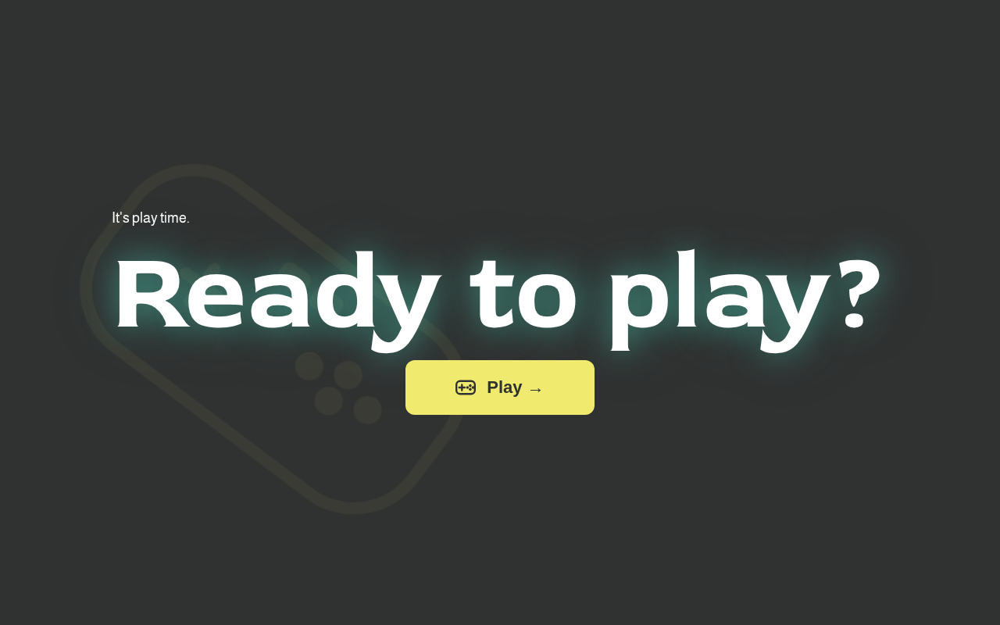
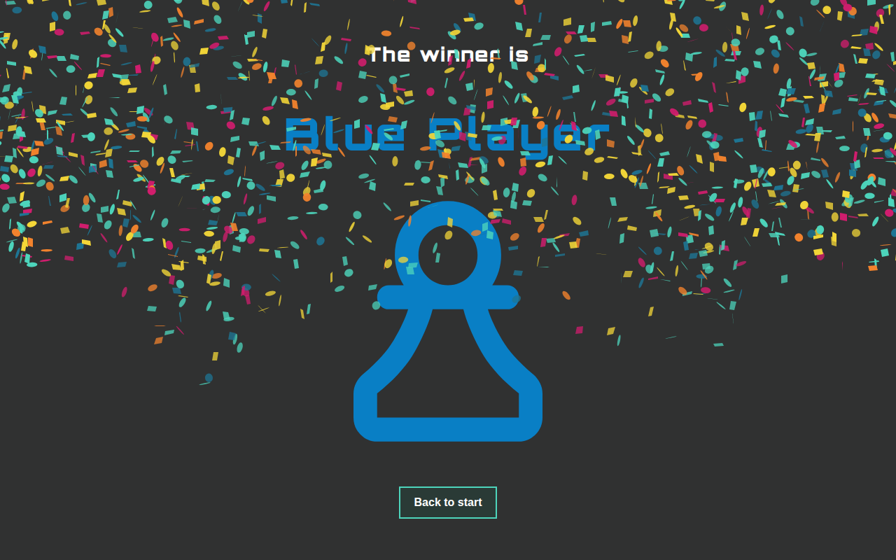
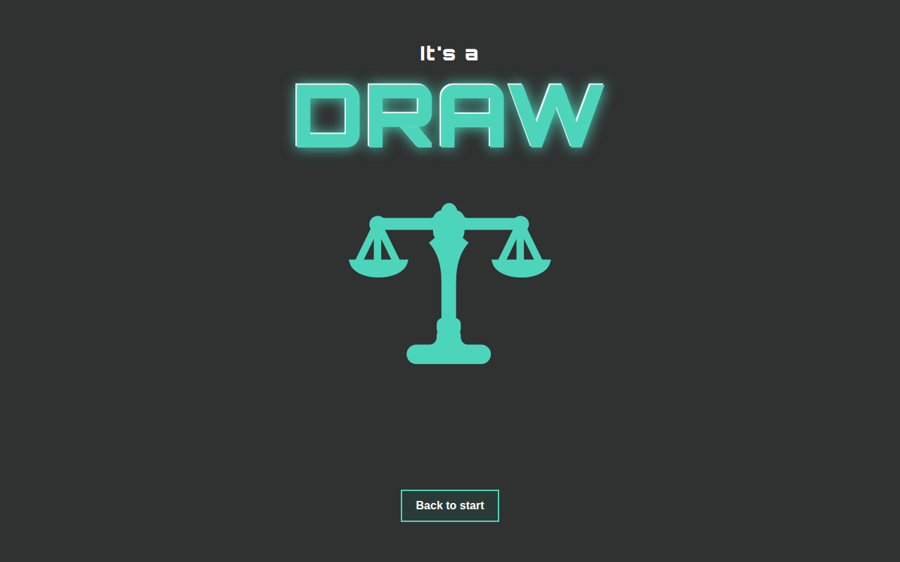

# Memory Game

A two-player browser-based memory card game with multiple themes. Built with Vite, TypeScript, and SCSS.



## Features

- **Two-player local multiplayer** — Blue vs. Orange take turns flipping cards
- **Three board sizes** — 16, 24, or 36 cards
- **Four visual themes** — each with unique card artwork, colors, and UI styling
- **Score tracking** — matched pairs count per player, winner announced at the end
- **Confetti animation** on the winner screen
- **Animated end screen** — slides in from the top

## Themes

| Theme | Description |
|-------|-------------|
| Code Vibes | Dark teal cyberpunk aesthetic |
| Gaming | Retro gaming controller style |
| DA Projects | Clean, professional look |
| Foods | Colorful food illustration cards |

## End Screens

<table>
  <tr>
    <td align="center"><strong>Winner</strong></td>
    <td align="center"><strong>Draw</strong></td>
  </tr>
  <tr>
    <td></td>
    <td></td>
  </tr>
</table>

## Tech Stack

- **Vite 8** — dev server & bundler
- **TypeScript** — strict typing throughout
- **SCSS** — 7-1 pattern, CSS custom properties for theming
- **canvas-confetti** — winner celebration

## Getting Started

```bash
npm install
npm run dev
```

Then open [http://localhost:5173/Memory/](http://localhost:5173/Memory/).

## Build

```bash
npm run build
npm run preview
```

## Dev Shortcuts

Append a hash to jump directly to an end screen during development:

```
#code-vibes-winner-blue
#code-vibes-winner-orange
#code-vibes-draw
#gaming-winner-blue
# … any theme prefix works
```
